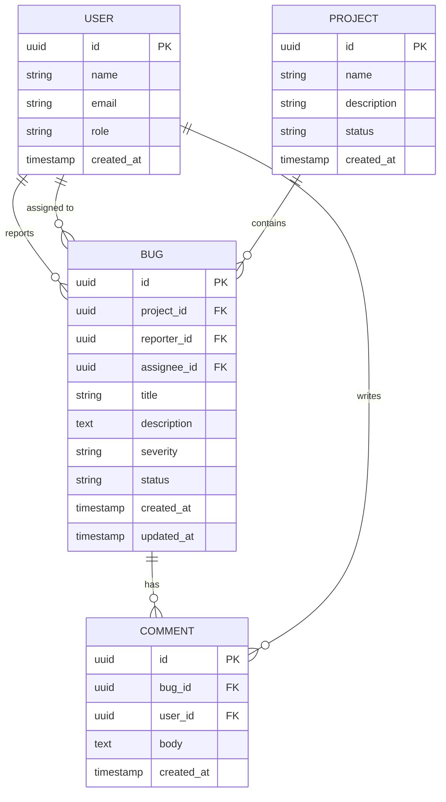

🇺🇸 [English](README.md) | 🇧🇷 [Português](README.pt.md)

# 🐞 Bug Tracker

<div align="center">


</div>

A full-featured bug tracking and management system. The application is split into a **RESTful API** built with Ruby on Rails and a modern **Single Page Application (SPA)** in React.

---

## ✨ Features

- **Integrated Dashboard** — Overview of all bugs: open, in progress, and resolved, with real-time metric cards.
- **Session-based Auth** — User registration and login. The session persists in the browser and automatically identifies the user when opening tickets or commenting.
- **Project Management** — Create, edit, and archive projects. Each project acts as an isolated bug tracking scope.
- **Bug Tracking** — Detailed cards with severity levels (Low, Medium, High, Critical), status, reporter, and assignee.
- **Comments** — Internal discussion thread per bug, with a character counter and automatic identification from the logged-in user.
- **Assignments** — Link users as *Reporter* and *Assignee* on each ticket.
- **Responsive UI** — CSS Grid layout, persistent fixed sidebar, cascading navigation with smart breadcrumbs.

---

## 🛠️ Tech Stack

| Layer | Technology |
|-------|------------|
| Backend | Ruby on Rails 8.x (API mode) |
| Database | SQLite (`storage/development.sqlite3`) |
| CORS | `rack-cors` |
| Frontend | React.js (SPA) |
| Styling | Dynamic CSS-in-JS |
| HTTP Client | Native Fetch API |

---

## 🗄️ Data Model

```
Users ──────────────────────────────────────────────┐
  id, name, email, password, role                   │
                                                     │
Projects                                            │
  id, name, description, status                     │
    │                                               │
    └──► Bugs ◄──────────────────────────────────── ┘
           id, title, description                  reporter_id / assignee_id
           severity (low|medium|high|critical)
           status (open|in_progress|resolved|closed)
           project_id, reporter_id, assignee_id
             │
             └──► Comments
                    id, body, bug_id, user_id
```

---

## 🗄️ Data Diagram



---

## 🚀 Running the Project

You will need **two terminals open** simultaneously.

### 1. Backend (Rails API)

```bash
# Install Ruby dependencies
bundle install

# Run database migrations
bin/rails db:migrate

# Start the server on port 3000
bin/rails server
```

> API available at `http://localhost:3000/api/v1`

### 2. Frontend (React)

```bash
# Navigate to the frontend folder
cd frontend

# Install Node dependencies
npm install

# Start the development server
npm start
```

> Interface available at `http://localhost:3001`  
> The frontend is pre-configured to consume the API on port `3000`.

---

## 📁 Project Structure

```
/
├── app/
│   ├── models/
│   │   ├── user.rb
│   │   ├── project.rb
│   │   ├── bug.rb
│   │   └── comment.rb
│   ├── controllers/
│   │   └── api/
│   │       └── v1/
│   │           ├── users_controller.rb
│   │           ├── projects_controller.rb
│   │           ├── bugs_controller.rb
│   │           ├── sessions_controller.rb
│   │           └── comments_controller.rb
│   └── views/
│       └── application/
│           └── index.html.erb   ← porta de entrada da SPA
├── frontend/                    ← React app
│   ├── src/
│   │   ├── context/
│   │   │   └── AuthContext.jsx
│   │   ├── components/
│   │   │   ├── BugCard.jsx
│   │   │   ├── BugForm.jsx
│   │   │   ├── CommentSection.jsx
│   │   │   ├── MetricCards.jsx
│   │   │   └── ProjectForm.jsx
│   │   ├── pages/
│   │   │   ├── AuthPage.jsx
│   │   │   ├── BugDetail.jsx
│   │   │   ├── Dashboard.jsx
│   │   │   └── Projects.jsx
│   │   ├── services/
│   │   │   └── api.js
│   │   └── App.jsx
│   └── package.json
└── config/
    └── routes.rb
```

---

## 🔌 API Endpoints

| Method | Route | Description |
|--------|-------|-------------|
| `POST` | `/api/v1/login` | User authentication |
| `GET` | `/api/v1/users` | List users |
| `POST` | `/api/v1/users` | Register user |
| `GET` | `/api/v1/projects` | List projects |
| `POST` | `/api/v1/projects` | Create project |
| `PUT` | `/api/v1/projects/:id` | Update project |
| `DELETE` | `/api/v1/projects/:id` | Delete project |
| `GET` | `/api/v1/bugs` | List bugs (supports filters) |
| `POST` | `/api/v1/bugs` | Create bug |
| `PUT` | `/api/v1/bugs/:id` | Update bug |
| `DELETE` | `/api/v1/bugs/:id` | Delete bug |
| `GET` | `/api/v1/bugs/:id/comments` | List comments |
| `POST` | `/api/v1/bugs/:id/comments` | Create comment |
| `DELETE` | `/api/v1/bugs/:bug_id/comments/:id` | Delete comment |

---

<div align="center">
Built with dedication to simplify task organization. 🚀
<br><br>
<a href="#-bug-tracker">⬆ Back to top</a>
</div>